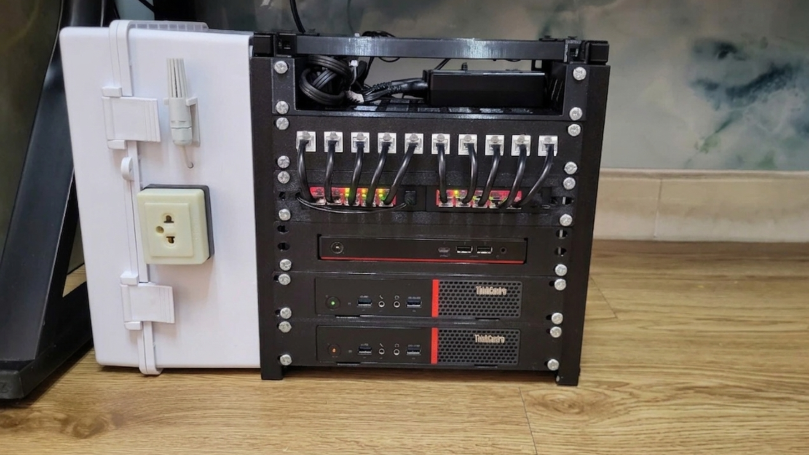
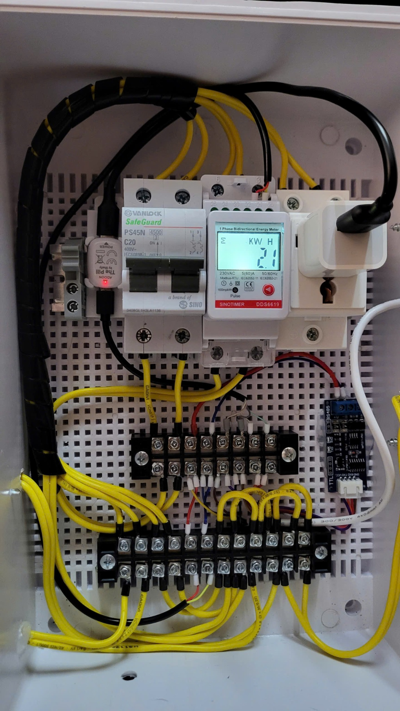

# Shelly The Pill Modbus RTU Home Server Monitor

This project uses **Shelly The Pill** as a compact **Modbus RTU gateway** to monitor a small home server rack.

The current implementation reads:

- A single-phase Modbus RTU energy meter
- An RS485 temperature and humidity sensor

The values are decoded by a Shelly Script and displayed through **Shelly Virtual Components**.

The project started as a home server power and environment monitor, but the same structure can be reused for solar inverters, battery systems, water meters, heat meters, ultrasonic liquid level sensors, photoelectric sensors, pressure sensors, and other Modbus RTU devices.

> Current status: working prototype using a UART TTL to RS485 module.  
> Future direction: this repository is prepared for updates when the Shelly The Pill Modbus add-on becomes available and tested.



---

## 1. Why this project exists

I run a small home server rack for IoT, automation, database, and monitoring services.

I wanted to monitor:

- Real-time power consumption
- Total energy usage
- Voltage, current, active power, power factor, and frequency
- Temperature around the rack
- Humidity around the rack

I also wanted to use a stable wired communication method instead of depending only on Wi-Fi sensors.

Modbus RTU is a good fit because it is wired, stable, noise-resistant, scalable, and widely supported by meters and industrial sensors.

---

## 2. Hardware

Main hardware used in this project:

- Shelly The Pill
- Shelly The Pill IO breakout
- UART TTL to RS485 module
- Single-phase Modbus RTU energy meter
- RS485 temperature and humidity sensor
- Terminal blocks and electrical protection
- Home server rack with network equipment and mini PCs



---

## 3. System architecture

```text
Shelly The Pill
      |
      | UART TX/RX
      v
UART TTL to RS485 Module
      |
      | RS485 A/B Bus
      v
+-------------------------------+
| Modbus RTU Energy Meter       |
| Slave ID: 1                   |
| Function: FC04                |
+-------------------------------+

+-------------------------------+
| RS485 Temp/Humidity Sensor    |
| Slave ID: 2                   |
| Function: FC03                |
+-------------------------------+

Shelly Script
      |
      v
Shelly Virtual Components
      |
      v
Shelly App / Shelly Dashboard
```

Shelly The Pill works as the **Modbus RTU master**.  
The energy meter and the temperature/humidity sensor work as **Modbus RTU slaves**.

---

## 4. Wiring overview

Shelly The Pill is connected to the UART TTL to RS485 module through the IO breakout.

```text
Shelly The Pill 5V   ->  RS485 Module VCC
Shelly The Pill GND  ->  RS485 Module GND
Shelly The Pill IO1  ->  RS485 Module RXD
Shelly The Pill IO2  ->  RS485 Module TXD
```

The RS485 side is connected to the Modbus devices:

```text
RS485 A+  ->  Energy Meter A / Sensor A
RS485 B-  ->  Energy Meter B / Sensor B
```


Common things to check when there is no Modbus response:

- TX/RX direction
- RS485 A/B polarity
- Baudrate
- Parity and stop bits
- Slave ID
- Register map
- Shared GND if required by the module
- Distance between mains wiring and signal wiring

---

## 5. Script and virtual components

The main script is here:

```text
src/shelly-the-pill-modbus-rtu.js
```

UART configuration:

```js
modbus_config({
  Baudrate: 9600,
  Mode: "8N1"
});
```

The script includes:

- Modbus CRC16
- FC03 read holding registers
- FC04 read input registers
- FC06 write single register
- FC16 write multiple registers
- Timeout handling
- Sequential polling
- Scaling and decimal conversion
- Shelly Virtual Component updates

### Energy meter - Slave ID 1

Function code: `FC04 - Read Input Registers`

| Value | Register | Type | Scale | Virtual Component |
|---|---:|---|---:|---|
| Voltage | `0x0000` | `u16` | `0.1` | `number:200` |
| Current | `0x0003` | `u16` | `0.01` | `number:201` |
| Active Power | `0x0008` | `s16` | `1` | `number:202` |
| Power Factor | `0x0014` | `u16` | `0.001` | `number:203` |
| Frequency | `0x001A` | `u16` | `0.01` | `number:204` |
| Total Active Energy | `0x001D` | `u32` | `0.01` | `number:205` |

### Temperature and humidity sensor - Slave ID 2

Function code: `FC03 - Read Holding Registers`

| Value | Register | Type | Scale | Virtual Component |
|---|---:|---|---:|---|
| Humidity | `0x0000` | `u16` | `0.1` | `number:207` |
| Temperature | `0x0001` | `u16` | `0.1` | `number:206` |

---

## 6. Setup

Basic setup steps:

1. Connect Shelly The Pill to the UART TTL to RS485 module.
2. Connect the RS485 A/B bus to the energy meter and the temperature/humidity sensor.
3. Set the energy meter to Slave ID `1`.
4. Set the temperature/humidity sensor to Slave ID `2`.
5. Confirm serial settings: `9600`, `8N1`.
6. Create Shelly Virtual Components `number:200` to `number:207`.
7. Upload `src/shelly-the-pill-modbus-rtu.js` to Shelly The Pill.
8. Start the script and check the values in Shelly.

See the detailed setup notes in [`docs/setup.md`](docs/setup.md).

---

## 7. Result

The final result is a compact monitoring system for my home server rack.

It shows:

- Voltage
- Current
- Active power
- Power factor
- Frequency
- Total active energy
- Temperature
- Humidity

The most important part is that Shelly The Pill becomes a bridge between the Shelly ecosystem and Modbus RTU devices.

This means the same idea can be reused with:

- Solar inverters
- Battery systems
- Ultrasonic tank level sensors
- Optical / photoelectric sensors
- Industrial temperature sensors
- Pressure sensors
- Water meters
- Heat meters
- Other Modbus RTU devices

---

## Repository map

```text
.
├── README.md
├── src/
│   └── shelly-the-pill-modbus-rtu.js
├── docs/
│   ├── challenge-entry-7-sections.md
│   ├── setup.md
│   ├── wiring.md
│   ├── modbus-register-map.md
│   ├── virtual-components.md
│   ├── future-modbus-addon.md
│   └── safety.md
├── images/
│   ├── updated-home-server-rack.png
│   ├── electrical-cabinet.jpg
│   └── the-pill-to-ttl-rs485-wiring.png
├── CHANGELOG.md
├── ROADMAP.md
└── LICENSE_NOTICE.md
```

---

## Notes about the future Shelly Modbus add-on

This repository is intentionally structured so it can be updated later.

The current version uses a generic UART TTL to RS485 module. When the Shelly The Pill Modbus add-on is ready for testing or public release, the repository can be expanded with:

- A dedicated wiring guide for the Shelly Modbus add-on
- A migration guide from UART TTL RS485 module to the add-on
- Updated photos
- Updated script examples
- Compatibility notes
- Test results

See [`docs/future-modbus-addon.md`](docs/future-modbus-addon.md).

---

## Safety note

This is a personal home lab / proof-of-concept project.

Anyone adapting this project should follow local electrical regulations and use correct protection devices, wire sizing, safe enclosures, and proper grounding.

Mains voltage work must be treated seriously. If you are not qualified, ask a qualified electrician to check the installation.
