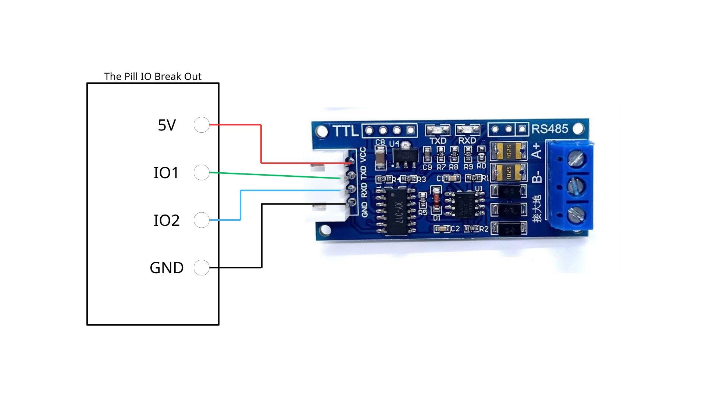

# Wiring

## Shelly The Pill to UART TTL RS485 module

```text
Shelly The Pill 5V   ->  RS485 Module VCC
Shelly The Pill GND  ->  RS485 Module GND
Shelly The Pill IO1  ->  RS485 Module RXD
Shelly The Pill IO2  ->  RS485 Module TXD
```



## RS485 bus

```text
RS485 A+  ->  Energy Meter A / Sensor A
RS485 B-  ->  Energy Meter B / Sensor B
```

## Notes

Some RS485 modules label TX/RX from the module point of view, while others label them from the external device point of view. If the module does not respond, check TX/RX first.

If the Modbus devices do not respond, also check:

- A/B polarity
- Baudrate
- Stop bits and parity
- Slave ID
- Register map
- Termination resistor requirement
- Bus length
- Cable routing near mains wires
